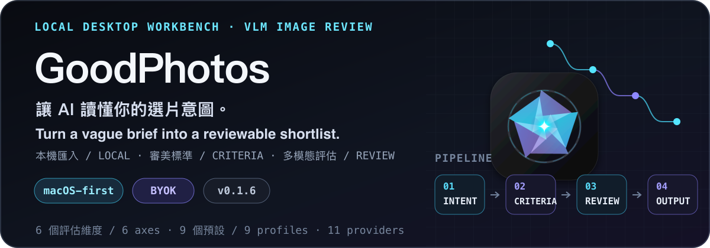

<p align="center">
  <picture>
    <source srcset="./assets/readme/hero.webp" type="image/webp">
    
  </picture>
</p>

<p align="center">
  <a href="#繁體中文">繁中</a> · <a href="#english">English</a>
</p>

<p align="center">
  <a href="https://github.com/punkcanyang/GoodPhotos/releases"></a>
  <a href="https://v2.tauri.app/"></a>
  <a href="https://react.dev/"></a>
</p>

## 繁體中文

GoodPhotos 是一個 macOS-first 的桌面選片工作台：把你對「想留下什麼」的模糊描述，轉成可檢查的審美標準，再用多模態模型批次評估照片、設計稿或渲染圖。

它不替你假裝做出客觀的「最好看」判決；它把你的意圖、選擇的審美視角與每張圖的理由放在同一個工作流裡，讓你更快找到值得留下的畫面。

### 工作流程

1. **匯入本機素材**：從檔案瀏覽器選擇資料夾、批次選取圖片，或直接拖曳加入工作區。
2. **描述這次要留下的畫面**：輸入一句自然語言意圖，再選擇內建審美預設或建立自訂視角。
3. **先顯化標準，再開始評估**：模型先把意圖展開成主題、主體、背景、光線、色調、風格、構圖與避雷條件，再按批次回傳每張圖片的 0–100 分、推薦狀態與短評。
4. **把結果變成下一步**：用推薦／落選／待評分與最低分數篩選結果，檢視 EXIF、標籤與 AI 評語，最後匯出 proofing gallery 或 XMP 評分。

評估前，GoodPhotos 會在本機把圖片縮小到最長邊 2048px 的 JPEG 資料；送往你設定的 Vision provider 是這份處理後的縮圖，不是原始檔。原始檔路徑仍由桌面端保留，供檢視與匯出使用。

### 主要能力

#### 用不同的眼光看同一批素材

內建 9 個審美預設，涵蓋：

- 畫廊紀實與敘事攝影
- 社交網路與人像商業照
- UI/UX 介面走查
- 商業海報與版式
- 概念設計與插畫
- 室內設計渲染
- 3D 產品渲染
- 商展／名片等圖文物料
- 合影與微表情優選

也可以在自訂模式中修改模型的人設提示與評估標準。

#### 把「好不好」拆成可討論的理由

批次評估會綜合 6 個維度：

- 構圖張力
- 光影層次
- 情緒強度
- 敘事含量
- 視覺記憶點
- 冗餘程度（反向扣分）

對包含名片、說明書或商展文字的素材，評估結果還可以帶回結構化 OCR 資料，方便複製與後續整理。

#### 評分之後仍然是檔案工作

- 以 Masonry 網格檢視、排序與過濾推薦結果
- 讀取資料夾、檔案大小、EXIF 與 macOS Finder 標籤
- 以批次操作貼標籤、複製、在 Finder 顯示，或交給預設圖片 App 開啟
- 將推薦照片輸出成可在瀏覽器開啟的 proofing gallery
- 將分數寫入 XMP sidecar，對接後續的照片管理流程
- 在大圖檢視器中以 Stability AI 擦除指定的路人、水印或雜物，另存為新圖

### Vision provider 與金鑰

目前程式內提供 11 個 Vision provider 設定：Qwen、OpenAI、OpenRouter、SiliconFlow、Together AI、Groq、Google Gemini、DeepSeek、智譜、豆包與 Mistral。每個 provider 可選預設模型，也可以手動填入其他模型名稱。

GoodPhotos 採 BYOK（Bring Your Own Key）：你在設定中填入自己的 API 金鑰，桌面端會將憑證交給作業系統的憑證庫保存。模型請求仍會依各 provider 的計費與資料政策計算；GoodPhotos 不替你承擔第三方 API 費用。

### 下載與使用

#### 直接下載

前往 [GitHub Releases](https://github.com/punkcanyang/GoodPhotos/releases) 下載最新版本。第一次啟動前，請先閱讀下方的 macOS 發布限制。

#### 從原始碼執行

需求：Node.js 22、Rust stable，以及 Tauri 2 所需的作業系統工具鏈。

```bash
git clone https://github.com/punkcanyang/GoodPhotos.git
cd GoodPhotos
npm ci
npm run tauri dev
```

API 金鑰可以在應用程式的設定視窗填入。若要執行品質檢查：

```bash
npm test
npm run build
cargo check --manifest-path src-tauri/Cargo.toml
```

### macOS 發布限制

目前公開的 macOS release 以 Apple Silicon（`aarch64`）為主，沒有加入付費 Apple Developer Program，因此下載的 App 沒有 Apple code signing，也沒有 notarization。第一次開啟時，macOS 可能需要你在系統設定中明確允許它執行；請只從本 repo 的 GitHub Release 下載。

應用程式內的更新封裝仍使用 GoodPhotos 專用 updater key 做密碼學簽名，CI 會檢查更新包、版本、下載網址、`latest.json` 與 DMG 完整性。這不等於 Apple 簽章，兩者是不同的信任邊界。

### 隱私與限制

- 原始影像會留在本機；需要 AI 評估時，會將本機處理後的縮圖送到你選擇的第三方 provider。
- BYOK 代表你需要自行理解 API 金鑰的費用、配額、保留政策與服務條款。
- XMP、Finder 標籤與檔案操作依賴 macOS 能力；跨平台支援不應視為已完成的產品承諾。
- 模型輸出的分數是輔助選片的觀點，不是攝影品質的客觀測量；請保留人工檢查。

### Repository map

- `src/`：React 介面、i18n、圖片處理、provider 與評估流程
- `src-tauri/`：Tauri 2、Rust 檔案操作、系統憑證庫、XMP 與 updater
- `tests/`：provider、rate limit、回應契約、gallery export 與 release integrity 測試
- `docs/dual-repo/`：公開桌面端與私有 billing backend 的協作文件

雙 repo 的工作入口在 [docs/dual-repo/README.md](./docs/dual-repo/README.md)。公開 repo 的 CI 也會執行 `npm run guard:public-repo`，避免把私有後端內容帶進桌面端。

### License

本 repository 目前未附 LICENSE 檔；若要重製、散布或整合，請先向作者確認授權範圍。

## English

GoodPhotos is a macOS-first desktop workspace for image selection. It turns a vague description of what you want to keep into explicit aesthetic criteria, then uses multimodal models to review photos, design boards, or renders in batches.

It does not pretend that there is one objective definition of the “best” image. Instead, it keeps your intent, the chosen aesthetic lens, and the reason behind each result in one workflow, so you can reach a defensible shortlist faster.

### Workflow

1. **Bring in local material**: choose a folder, select multiple images from the file browser, or drag images into the workspace.
2. **Describe what should survive the edit**: enter a natural-language brief, then choose a built-in aesthetic profile or create a custom one.
3. **Manifest criteria before scoring**: the model expands the brief into theme, subject, background, lighting, color, style, composition, and negative constraints, then returns a 0–100 score, recommendation state, and short critique for each image.
4. **Turn scores into action**: filter by recommended, rejected, unscored, or minimum score; inspect EXIF, tags, and critiques; then export a proofing gallery or XMP ratings.

Before evaluation, GoodPhotos downsizes each image locally into JPEG data with a maximum edge of 2048px. The Vision provider receives this processed thumbnail rather than the original file. The desktop app keeps the original path for inspection and export.

### Capabilities

#### Apply different standards to the same material

The app includes 9 aesthetic profiles for:

- gallery documentary and narrative photography
- social-media and portrait commercial work
- UI/UX review
- commercial posters and typography
- concept art and illustration
- interior design renders
- 3D product renders
- business cards, point-of-sale, and text-heavy layouts
- group-photo and facial-expression selection

Custom mode lets you edit the model persona and evaluation standard.

#### Make “good or bad” debatable

Batch evaluation combines six dimensions:

- compositional tension
- lighting depth
- emotional intensity
- narrative content
- visual memorability
- redundancy, applied as a negative factor

For business cards, manuals, posters, or other text-heavy material, the response can also include structured OCR data for copying and downstream organization.

#### Keep the file workflow after scoring

- review, sort, and filter recommendations in a Masonry grid
- read folders, file sizes, EXIF, and macOS Finder tags
- batch-tag, copy, reveal in Finder, or open images with the default app
- export recommended images as a browser-readable proofing gallery
- write scores to XMP sidecars for the next stage of photo management
- use Stability AI in the large-image viewer to erase selected people, watermarks, or distractions into a new file

### Vision providers and keys

The codebase currently defines 11 Vision provider configurations: Qwen, OpenAI, OpenRouter, SiliconFlow, Together AI, Groq, Google Gemini, DeepSeek, Zhipu, Doubao, and Mistral. Each provider has preset models, and the model field also accepts a custom model name.

GoodPhotos uses BYOK (Bring Your Own Key). Enter your own API key in Settings; the desktop app stores the credential through the operating system credential store. Requests remain subject to each provider’s pricing and data policy, and GoodPhotos does not pay third-party API charges for you.

### Download and run

#### Download a release

Get the latest build from [GitHub Releases](https://github.com/punkcanyang/GoodPhotos/releases). Read the macOS release limitations below before launching it for the first time.

#### Run from source

Requirements: Node.js 22, stable Rust, and the platform toolchain required by Tauri 2.

```bash
git clone https://github.com/punkcanyang/GoodPhotos.git
cd GoodPhotos
npm ci
npm run tauri dev
```

API keys can be entered in the application Settings window. Run the quality checks with:

```bash
npm test
npm run build
cargo check --manifest-path src-tauri/Cargo.toml
```

### macOS release limitations

Public macOS releases currently target Apple Silicon (`aarch64`). The project is not enrolled in the paid Apple Developer Program, so downloaded apps are not Apple code-signed and are not notarized. macOS may require explicit permission in System Settings on first launch; download releases only from this repository’s GitHub Release page.

The in-app update package is still cryptographically signed with the dedicated GoodPhotos updater key. CI checks the update archive, version, download URL, `latest.json`, and DMG integrity. This is not Apple signing; the two mechanisms provide different trust boundaries.

### Privacy and limits

- Original images stay on the local machine; AI evaluation sends a locally processed thumbnail to the third-party provider you choose.
- BYOK means you are responsible for API costs, quotas, retention policies, and provider terms.
- XMP, Finder tags, and native file operations depend on macOS capabilities; cross-platform support should not be treated as a completed product promise.
- Model scores are a point of view to assist selection, not an objective measurement of photographic quality. Keep human review in the loop.

### Repository map

- `src/`: React UI, i18n, image processing, providers, and evaluation flow
- `src-tauri/`: Tauri 2, Rust file operations, credential store, XMP, and updater
- `tests/`: provider, rate-limit, response-contract, gallery-export, and release-integrity tests
- `docs/dual-repo/`: collaboration docs for the public desktop app and private billing backend

The dual-repo entry point is [docs/dual-repo/README.md](./docs/dual-repo/README.md). Public-repository CI also runs `npm run guard:public-repo` to keep private backend material out of the desktop repository.

### License

This repository currently does not include a LICENSE file. Please contact the author before reproducing, distributing, or integrating the project.
